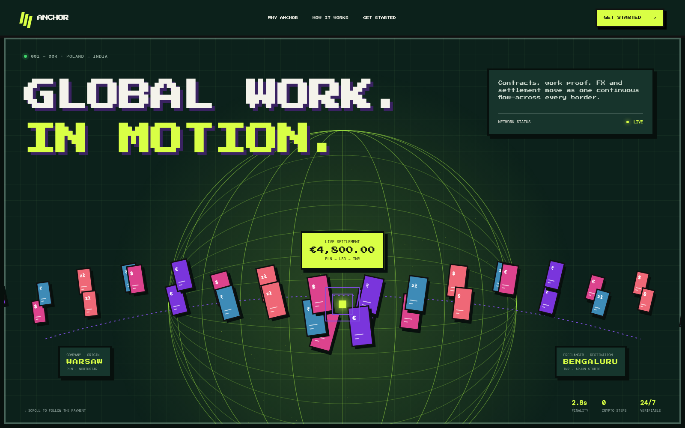
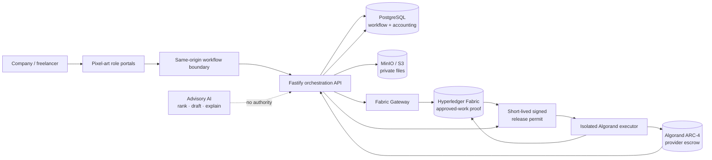
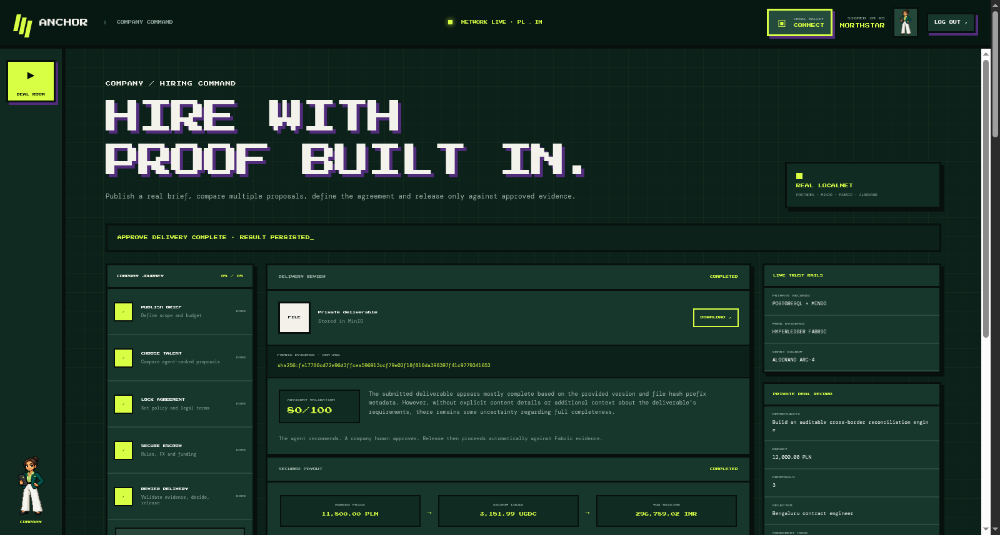
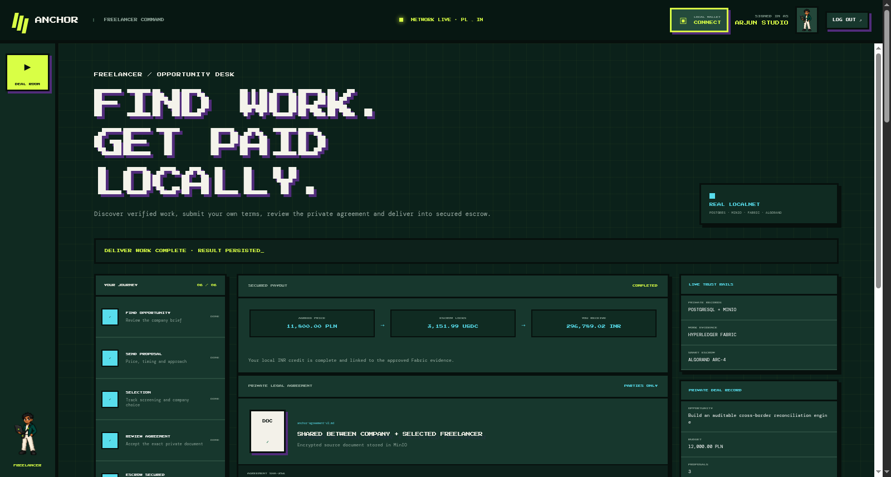

<div align="center">

# Anchor

### Hire globally. Settle with proof.

**An auditable cross-border work marketplace that connects hiring, work approval, compliance, FX, escrow and payout—without making workers touch crypto.**

[](https://nodejs.org/)
[](https://www.typescriptlang.org/)
[](https://www.hyperledger.org/projects/fabric)
[](https://developer.algorand.org/)
[](https://www.postgresql.org/)
[](https://github.com/Preethesh16/HardCoders_/actions/workflows/verify.yml)

</div>



> **The core insight:** one ledger should not be forced to prove everything. Fabric proves **what work was approved**. Algorand proves **that settlement happened**. PostgreSQL proves **who, how much and why**.

## The 30-second pitch

Global work is easy to start and painfully hard to finish. Hiring, identity, contracts, work acceptance, regulatory checks, FX, settlement and payout usually live in disconnected systems. When something goes wrong, every party has a different version of the truth.

Anchor turns that fragmented process into one explainable pipeline. A company pays in its local currency, a freelancer or supplier receives local currency, and licensed-provider simulation accounts handle the settlement layer. End users never see a wallet, hold a token or manage a blockchain key.

The working demonstration completes two deliberately different journeys:

| Journey | Business case | Book | Demonstration result |
|---|---|---:|---|
| 🇵🇱 Poland → 🇮🇳 India | Freelancer payment after approved work | `INWARD` | `12,000 PLN → 2,985 USDC → 247,466.93 INR` |
| 🇮🇳 India → 🇬🇧 United Kingdom | Supplier payment with import evidence | `OUTWARD` | `800,000 INR → 9,567.92 USDC → 7,537.10 GBP` |

The sample amounts above use deterministic demo FX fixtures. Every token and fiat balance in this repository is a zero-value simulation.

## Why Anchor is different

Most payment demos put a transfer on-chain and stop. Anchor tackles the harder question: **what evidence should authorize that transfer, who is allowed to approve it, and how can an auditor reconstruct the decision later?**

| Evaluation lens | What Anchor demonstrates |
|---|---|
| **Innovation** | A purpose-built three-ledger trust model instead of “put everything on a blockchain.” |
| **Technical depth** | Fabric chaincode, an ARC-4 escrow, isolated signing, cryptographic release permits, exact-money FX and double-entry accounting. |
| **Real-world relevance** | Local-currency user experience, corridor-specific rules, evidence-controlled release and separate inward/outward books. |
| **Responsible AI** | AI can shortlist, draft and explain; it cannot verify identity, change compliance, approve work or release funds. |
| **Auditability** | Every material outcome is tied to a rule version, quote hash, evidence hash, actor and ordered timeline event. |
| **Demo readiness** | One command launches the app; one button runs both journeys through the same domain services used by the HTTP API. |

## The product that works today

Anchor exposes exactly two human roles—**Company** and **Freelancer**—inside one
shared pixel-art deal room. Provider settlement, compliance, evidence recording
and audit remain automated platform services, not fake login personas.

| Company controls | Freelancer controls | Anchor automates |
|---|---|---|
| Publish a blank work brief | Discover the published opportunity | Collect and rank three proposals |
| Compare ranked proposals and select a person | Submit price, timing, availability and approach | Draft the private agreement |
| Define commercial, policy and legal terms | Review and accept the identical agreement hash | Refresh official rules and calculate live FX |
| Download evidence and approve or reject delivery | Upload any deliverable and receive local payout | Fund escrow, validate evidence and release settlement |

The two browser sessions poll the same shared cursor. Opening a Freelancer tab
cannot create or reset a job; only the Company sees an explicit reset control.
The cursor survives UI-service restarts, while authoritative business records,
files and ledger proofs remain in PostgreSQL, MinIO, Fabric and Algorand.

### Company access starts before the deal

The Company portal now opens through a login-time **Authorization Agent**, not
through an unverified role switch. A reviewable onboarding document can
autofill the legal name, jurisdiction, registry number, LEI, address,
directors/PSCs and representative mandate. Anchor then separates two questions:

1. **Does the legal entity exist and remain active?** The demo reads the live
   [Companies House public register](https://find-and-update.company-information.service.gov.uk/company/07209813)
   and [GLEIF API](https://www.gleif.org/en/lei-data/gleif-api).
2. **May this signed-in person act for that tenant?** PostgreSQL tenant
   membership and a recorded mandate answer this independently; a public
   company record is never treated as login authority.

Entity, officer and beneficial-owner names are checked against the official
[UK Sanctions List](https://www.gov.uk/government/publications/the-uk-sanctions-list),
[UN consolidated list](https://main.un.org/securitycouncil/en/content/un-sc-consolidated-list),
[EU financial-sanctions dataset](https://data.europa.eu/data/datasets/consolidated-list-of-persons-groups-and-entities-subject-to-eu-financial-sanctions?locale=en)
and [OFAC Sanctions List Service](https://ofac.treasury.gov/sanctions-list-service).
The local sample uses public data for **WISE PAYMENTS LIMITED** solely to prove
the registry connectors; this repository has no affiliation with that company,
and its representative mandate is explicitly fictional and zero-value.

## Three ledgers, one workflow

| Boundary | Owns | Explicitly does **not** own |
|---|---|---|
| **Hyperledger Fabric** | Work-evidence hash, version, timestamp, seller identity reference and buyer approval/revision decision | Names, files, contract text, FX, payment state, wallet addresses |
| **Algorand** | Hashed payment identity, provider addresses, escrow amount and release/refund state | End-user identity, invoices, resumés, work files, regulatory text |
| **PostgreSQL** | Marketplace state, credentials, corridor policy, FX snapshots, compliance decisions, fiat balances, timeline and reconciliation | Raw blockchain signing keys |
| **MinIO / S3** | Private resumés, invoices, identity evidence and deliverables behind short-lived signed URLs | Public access and ledger state |



## One continuous deal

```text
Company publishes a brief
        ↓
Freelancer submits price + delivery proposal
        ↓
AI ranks three candidates → Company makes the final selection
        ↓
Company defines terms → both parties approve one document hash
        ↓
Rules + live FX + compliance execute automatically
        ↓
Provider funds a fixed-value Algorand ARC-4 escrow
        ↓
Freelancer uploads privately → SHA-256 evidence enters Fabric
        ↓
AI validates as advice → Company makes the approval decision
        ↓
Fabric-bound permit releases escrow → INR balance is credited
```

Only seven human commands exist: publish, apply, select, define terms, accept
terms, deliver and approve. The progress rail displays the automatic stages but
does not turn infrastructure operations into decorative buttons.

### Verified live-FX example

The latest browser-driven acceptance run selected an `11,800 PLN` proposal and
used the Frankfurter/ECB reference adapter:

```text
11,800.00 PLN × 0.26846                 = 3,167.828000 USD
3,167.828000 USD − 50 bps origin fee   = 3,151.988860 USDC locked
3,151.988860 USD × 94.49                =   297,831.43 INR
297,831.43 INR − 35 bps destination fee =   296,789.02 INR credited
```

The quote stores both legs, fee amounts, observation time, expiry and canonical
hash. Funding fixes the USDC amount, so later FX movement cannot change the
already secured escrow. This browser journey runs on **Algorand LocalNet** with
a zero-value six-decimal demo ASA; the separately linked public TestNet proof is
not substituted into the local demo.

## The release path: proof before payout

1. The seller uploads a deliverable to private object storage; Anchor computes its SHA-256 commitment.
2. Fabric records the exact evidence ID, file hash, milestone version and seller reference—never the file or personal data.
3. Only the contract's buyer organization can approve that exact version or request a revision.
4. Compliance and FX engines produce versioned, canonical commitments using integer minor units—never floating-point money.
5. The Fabric Gateway issues a short-lived Ed25519 permit binding the escrow, approved evidence, Fabric transaction, compliance result, FX quote, generation and idempotency key.
6. The isolated executor re-reads the authoritative Fabric evidence before signing an Algorand transaction.
7. Signed bytes are persisted **before** broadcast, so an ambiguous network response can be reconciled without creating or signing a second transfer.
8. Only after settlement confirmation does the destination provider post the beneficiary's simulated local-currency credit.

This makes a database flag such as `APPROVED=true` insufficient to move money. The release must still match the cryptographic evidence and every bound decision that produced it.

## Run the judge demo

### Fast browser preview

#### Prerequisites

- Node.js `24.x`
- pnpm via Corepack

No database, blockchain node, paid API, faucet or secret is required for the default demonstration.

```bash
git clone https://github.com/Preethesh16/HardCoders_.git
cd HardCoders_
corepack pnpm install
corepack pnpm demo
```

Open [Anchor](http://127.0.0.1:4175), or use the direct role links in two tabs:

- [Company portal](http://127.0.0.1:4175/?role=company)
- [Freelancer portal](http://127.0.0.1:4175/?role=freelancer)

The Company publishes an empty brief, compares three independent proposals and
selects one freelancer. The Freelancer accepts the exact private agreement and
uploads a real file. Screening, official-source review, compliance, FX, escrow
funding, work validation and release then advance automatically as visible,
non-clickable stages inside the same Anchor experience.

### Full cryptographic proof run

The acceptance profile replaces every simulated persistence and blockchain
adapter with PostgreSQL, MinIO, a two-organization Fabric network, the real
Fabric Gateway, AlgoKit LocalNet, the deployed ARC-4 escrow and the durable
Algorand executor. It generates owner-only local keys and requires no API key,
faucet or paid service.

Additional prerequisites: Docker with Compose, AlgoKit and `rg`.

```bash
corepack pnpm install --frozen-lockfile
corepack pnpm local:e2e
```

The command starts isolated resources, deploys `OptiUSD-DEMO` and the escrow,
executes both HTTP journeys, verifies both ledgers, checks cross-organization
authorization and privacy boundaries, smoke-tests the buyer and seller views, then
opens the integrated portal in a real headless browser and completes its
seven-action role-aware workflow—including private agreement hash verification
for both parties and an arbitrary binary deliverable round-trip. It leaves the product experience running at
[http://127.0.0.1:4175](http://127.0.0.1:4175). Legacy `:3000` dashboard URLs
redirect into this same product instead of exposing a second visual system.
See the [LocalNet runbook](docs/LOCALNET_RUNBOOK.md) for ports, lifecycle
commands, generated artifacts and troubleshooting.

The product has two marketplace roles. Infrastructure proof is embedded in
their transaction context instead of presented as additional people:

- **Buyer / company** — applicant selection, bilateral contract approval, FX, compliance, escrow and reconciliation proof.
- **Seller / freelancer** — agreed terms, submission versions, buyer decision, escrow proof and local-currency credit.

Provider settlement, compliance, evidence recording and audit are automated
Anchor services. They do not log in, choose work or appear as user roles.

### 90-second evaluator walkthrough

1. Open `:4175` in two tabs: enter one as **Company** and the other as **Freelancer**. Both poll the same shared deal cursor; its business records remain in PostgreSQL/MinIO and the cursor survives UI-service restarts.
2. Company publishes the work; freelancer applies; the agent shortlists; then the company explicitly assigns the applicant.
3. Both parties approve the exact contract hash. Anchor automatically runs the official-source check, live FX, compliance and real LocalNet ARC-4 funding.
4. Freelancer uploads the actual deliverable. Company grants review access, runs advisory validation, approves on Fabric and releases escrow.
5. Inspect the contextual service proof in the same deal room; there is no separate provider or administrator persona.

To repeat that exact two-browser journey automatically against the running real
services, run `pnpm test:browser:roles`. This intentionally starts a new shared
deal, drives both role forms (including a real file upload), and fails unless
Fabric approval and Algorand release both complete.

## Product tour

### One visual system, two accountable humans

<table>
  <tr>
    <td width="50%"></td>
    <td width="50%"></td>
  </tr>
  <tr>
    <td align="center"><strong>Company / buyer</strong><br/>Five-stage hiring, agreement, escrow and evidence-approval journey.</td>
    <td align="center"><strong>Freelancer / seller</strong><br/>Six-stage proposal, agreement, private delivery and local-payout journey.</td>
  </tr>
</table>

These screenshots are captured by the two-browser acceptance test after the
same deal reaches `COMPLETED`. The side rail is role-specific; hashes, ARC-4
application/ASA references and the private agreement remain visible in context.

## Architecture and technology

Anchor is intentionally a **modular monolith plus two isolated blockchain gateways**. That keeps the business workflow easy to reason about while preserving hard security boundaries around ledger access and signing. No Kafka, Kubernetes or microservice sprawl is needed for the prototype.

| Layer | Technology | Responsibility |
|---|---|---|
| Product experience | Pixel-art HTML/CSS/JavaScript portal served by Node; legacy Next.js routes redirect here | One canonical Company/Freelancer interface; no browser-side blockchain keys |
| API | Node.js 24, TypeScript 5.9, Fastify 5, TypeBox | Marketplace, identity, corridor, compliance, FX and payment orchestration |
| Business data | PostgreSQL 17, Drizzle ORM, pgvector | Workflow, versioned decisions, exact-money books and reconciliation |
| Private files | MinIO locally, S3-compatible storage | Opaque object keys and short-lived authorized access |
| Authentication | Keycloak OIDC | Buyer/company and seller/freelancer roles; platform services use internal identities |
| Work trust | Hyperledger Fabric 2.5, Go chaincode, TypeScript Gateway | Evidence commitments, ownership-aware decisions, history and event checkpoints |
| Settlement | Algorand ARC-4, Algorand TypeScript / Puya, AlgoKit | Create, fund, pause, release, refund and complete provider escrow |
| FX | Frankfurter adapter + deterministic fixtures | PLN→USD→INR and INR→USD→GBP quotes with explicit fees and expiry |
| AI | OpenAI Responses API + recorded fallback | Advisory scoring, drafting, explanation and validation recommendations |

## Security and correctness invariants

- **No end-user crypto custody.** Only isolated provider/executor accounts interact with Algorand.
- **No PII on public or consortium ledgers.** Names, emails, passports, resumés and raw document identifiers are rejected from ledger and AI trace boundaries.
- **Ownership at the trust boundary.** Seller and buyer organizations are bound to evidence; an authenticated user from another tenant cannot read or decide it.
- **Idempotency on every mutation.** Exact retries return the recorded response; reusing a key with different input is a conflict.
- **Exact money only.** Amounts are integer minor units with explicit currency and scale; rounding is deterministic and tested.
- **Inward/outward isolation.** A journal line cannot reference an account from another book or direction, enforced in domain logic and SQL constraints.
- **Fail-closed expiry.** Credentials, FX quotes and release permits cannot be used after expiration.
- **Replay-resistant settlement.** One generation and one idempotency key authorize one escrow action.
- **MainNet refusal.** The executor validates the genesis hash and rejects Algorand MainNet configuration.
- **Human authority stays human.** AI never selects a winning applicant by itself and has no call path to approval, compliance mutation or signing.

## API surface

The API exposes real workflow commands rather than a single scripted endpoint. Representative routes:

```text
POST /v1/jobs
POST /v1/jobs/:id/applications
GET  /v1/jobs/:id/applications
POST /v1/jobs/:id/applications/rank
POST /v1/applications/:id/evaluate
POST /v1/applications/:id/select
POST /v1/contracts/:id/agreement
GET  /v1/contracts/:id/agreement/access
POST /v1/contracts/:id/approve

POST /v1/credentials/verify
POST /v1/corridors/resolve
POST /v1/fx/quotes
POST /v1/contracts/:id/regulations/refresh

POST /v1/contracts/:id/submissions
POST /v1/submissions/:id/evaluate
POST /v1/submissions/:id/approve
GET  /v1/submissions/:id/access

POST /v1/payments
POST /v1/payments/:id/fund
POST /v1/payments/:id/release
POST /v1/payments/:id/refund
GET  /v1/payments/:id/timeline

POST /v1/supplier-payments
POST /v1/payments/:id/reconcile
```

Every mutation requires authentication and an `Idempotency-Key`. Demo-only walkthrough and principal routes do not exist outside the demo profile.

## Verification

```bash
corepack pnpm verify
cd blockchain/fabric/chaincode && go test ./...
cd ../../..
corepack pnpm local:e2e
corepack pnpm test:browser:roles
```

The automated suite covers:

- both complete corridors, revision/refund paths and unsupported or expired inputs;
- cross-tenant read/decision rejection and evidence version ownership;
- canonical hashing, credential verification, exact FX and cap boundaries;
- one shared, runtime-validated compliance decision contract whose stored hash is rechecked on hydration;
- double-entry balance and hard inward/outward book isolation;
- Fabric Gateway ↔ Algorand executor permit compatibility;
- altered evidence, expired permits, provider substitution and duplicate release rejection;
- persisted-signed-transaction recovery and ambiguous broadcast reconciliation;
- ARC-4 create, fund, partial release, pause/resume, refund and completion behavior;
- Algorand LocalNet and public TestNet lifecycle suites as explicit opt-in tests.
- two isolated browser sessions proving Company publish → Freelancer apply,
  three-candidate screening, bilateral agreement, arbitrary file upload, Fabric
  approval and Algorand release without cross-role reset races.

```bash
corepack pnpm --filter @optiwork/algorand-executor test:localnet
corepack pnpm --filter @optiwork/algorand-executor test:testnet
```

### Public TestNet proof

Anchor's ARC-4 escrow is deployed on Algorand TestNet as
[application `770960502`](https://lora.algokit.io/testnet/application/770960502),
using Circle's official zero-value TestNet USDC
[ASA `10458941`](https://lora.algokit.io/testnet/asset/10458941). The opt-in
public lifecycle passed on 4 September 2026, including release, refund, replay
protection and stranded-transaction recovery. Inspect the confirmed
[evidence-bound release](https://lora.algokit.io/testnet/transaction/T5426Z7ZHRGR5VR5BC7YO52B46PM764DIKYWUQEIRO37CRMFNG3Q)
or the sanitized [deployment and acceptance manifest](services/algorand-executor/testnet/deployment-manifest.json).
Test ALGO and TestNet USDC have no monetary value.

## Implementation status

| Capability | Status |
|---|---|
| Company onboarding and login authorization | ✅ Live Companies House + GLEIF checks, official-list screening, separate tenant mandate and persisted decision hash |
| Integrated company/freelancer deal room and seven human decisions | ✅ Role-specific controls, cross-tab job visibility, Company-only reset and restart-persistent shared cursor |
| Multi-applicant hiring and private agreement | ✅ Three independent proposals, advisory ranking, human selection, party-only MinIO document and stable hashes |
| Live decision support | ✅ OpenAI advisory agents, Frankfurter reference FX and seven official regulation-source observations, each with visible fallback provenance |
| Buyer and seller proof views plus two-corridor demonstration | ✅ Platform-service evidence is embedded without inventing extra user roles |
| Marketplace, contracts, credentials, compliance, FX, books and timelines | ✅ Implemented, runtime-validated and tested |
| PostgreSQL and MinIO adapters | ✅ Real local acceptance profile verified |
| Keycloak OIDC adapter and realm | ✅ Implemented; production OIDC deployment deferred |
| Fabric evidence chaincode and Gateway | ✅ Implemented and tested |
| ARC-4 escrow and isolated Algorand executor | ✅ Implemented and tested |
| Fabric-to-executor release contract | ✅ Cross-service integration tested |
| Fully automated real Fabric + Algorand LocalNet journeys | ✅ Browser workflow and both API corridors complete with confirmed transactions |
| Public Algorand TestNet deployment and lifecycle | ✅ App `770960502`; official USDC; explorer-confirmed release/refund/recovery |
| Production OIDC deployment and custody hardening | ⏭️ Explicitly deferred |

Both paths are free and deterministic. The fast preview is convenient for UI
evaluation; `local:e2e` is the acceptance path for real local infrastructure and
blockchain proof. The public TestNet proof is complete but remains opt-in so
evaluation never depends on a faucet or external service.

## Repository map

```text
apps/api                    Fastify API, workflow services, Drizzle schema and migrations
apps/marketing              Integrated landing page, role portal and live workflow driver
apps/web                    Legacy Next.js routes, redirects and remittance advice
packages/contracts          Shared TypeBox boundary schemas
packages/domain             Money, corridor, state-machine and ledger invariants
services/fabric-gateway     Fabric access, identity mapping, permits and checkpoints
services/algorand-executor  Isolated signing, command journal and reconciliation
blockchain/fabric           Evidence-only Go chaincode
infra                       Compose profiles, Keycloak realm and container builds
docs                        Architecture plan, ADRs and third-party provenance
```

## Design documents

- [Consolidated architecture plan](docs/ARCHITECTURE_PLAN.md)
- [ADR 001 — Three-ledger boundaries](docs/architecture/adr-001-three-ledger-boundaries.md)
- [ADR 002 — Algorand settlement](docs/architecture/adr-002-algorand-settlement.md)
- [ADR 003 — Fabric for work evidence only](docs/architecture/adr-003-fabric-work-evidence-only.md)
- [Third-party provenance](docs/THIRD_PARTY_PROVENANCE.md)
- [Real LocalNet runbook](docs/LOCALNET_RUNBOOK.md)

## Scope and disclaimer

Anchor is a technical demonstration—not a licensed remittance, payment, KYC, tax-filing or legal-compliance service. Regulatory documents and remittance advice are visibly watermarked. Test assets have no monetary value. The policy engine demonstrates source-versioned controls; a real deployment would still require licensed providers, jurisdiction-specific legal review, operational controls and production security assessment.

---

<div align="center">

**Anchor does not ask you to trust a dashboard. It lets every party verify the evidence, the decision and the settlement.**

</div>
