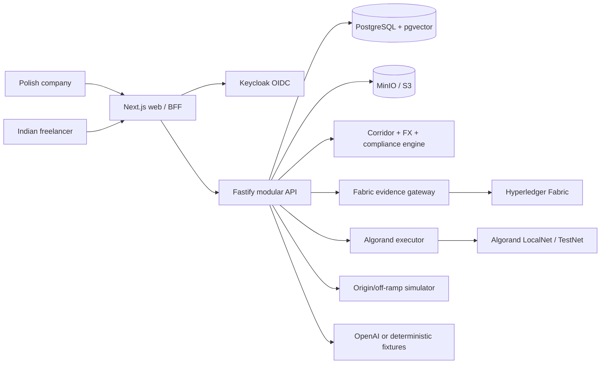

# Anchor consolidated cross-border architecture

## Decision summary

OptiWork is a hackathon-grade, end-to-end marketplace for verified international
work. It deliberately uses three different ledgers because they have different
trust and privacy properties:

1. **Hyperledger Fabric** stores only work-evidence commitments and the buyer's
   decision on a submitted version.
2. **Algorand** holds zero-value test USDC in provider-to-provider escrow and
   enforces release, refund and replay protection.
3. **PostgreSQL** is the business system of record for marketplace data,
   corridor policy, FX quotes, simulated fiat wallets and reconciliation.

The flagship journey is a Polish company paying an Indian freelancer. A second
India-to-United-Kingdom supplier journey proves that inward and outward books
remain separate. End users never handle a token or a blockchain key.

This is a demonstration, not a licensed remittance, KYC, tax-filing or legal
service. Every token and generated remittance document is visibly labelled as a
test/demo artifact.

## System shape

The API orchestrates a durable saga. Fabric and Algorand remain independently
reconcilable; a PostgreSQL status is never treated as proof that either ledger
committed.

## Technology stack

| Boundary | Technology | Purpose |
|---|---|---|
| Monorepo | pnpm workspaces, Turborepo, Node.js 24, TypeScript 5.9 | Shared schemas and repeatable gates. |
| Web | Next.js 16, React 19, Tailwind-compatible CSS | Company, freelancer, provider and admin views. |
| API | Fastify 5, TypeBox | Runtime-validated REST commands and OpenAPI-ready schemas. |
| Business data | PostgreSQL 17, Drizzle, pgvector | Marketplace, rules, double-entry books, audit and RAG. |
| Files | MinIO locally, S3-compatible storage when hosted | Resumes, evidence and documents behind signed URLs. |
| Identity | Keycloak OIDC, `did:key`, Ed25519 credentials | Tenant access plus portable prototype identity claims. |
| Work evidence | Fabric 2.5, Go chaincode, TypeScript Gateway | Immutable work hashes and buyer decisions only. |
| Settlement | Algorand ARC-4, Algorand TypeScript/Puya, AlgoKit | Provider-to-provider test-USDC escrow. |
| FX | Frankfurter reference adapter with fixtures | PLN/USD and USD/INR legs with expiry and fixed-point math. |
| AI | OpenAI Responses API with fixture fallback | Explainable shortlist, drafting and advisory analysis. |
| Runtime | Docker Compose, AlgoKit LocalNet, isolated Fabric network | One-command, offline, real-ledger acceptance profile; TestNet is a deferred public proof mode. |

Algorand TestNet uses Circle's zero-value USDC ASA `10458941`, scale six.

At release time, a deterministic settlement router obtains fresh FX evidence
and quotes three zero-value provider adapters. Hard legal, corridor, currency,
liquidity, operational and freshness constraints run before optimization. The
complete candidate set and selected route are stored in PostgreSQL, and the
selected route hash is included in the Fabric-signed release authorization
whose commitment is recorded by Algorand. See
[`DYNAMIC_SETTLEMENT_ROUTER.md`](DYNAMIC_SETTLEMENT_ROUTER.md).
LocalNet creates a zero-value `OptiUSD-DEMO` ASA. Mainnet is rejected by
configuration.

## Data classification

| Store | Allowed data | Forbidden data |
|---|---|---|
| Fabric | Contract/milestone digests, SHA-256 file hash, seller reference, version, timestamps, buyer decision/hash | Names, contact data, files, contract text, payment state, wallet addresses, identity documents |
| Algorand | Hashed payment/agreement keys, provider addresses, asset/application IDs, amounts, release commitments | End-user identity, invoices, work files, regulatory text |
| PostgreSQL | Authoritative business records, corridor versions, FX snapshots, journals, workflow/reconciliation state | Raw signing keys |
| MinIO/S3 | Encrypted resumes, identity evidence, contracts, invoices and work files | Ledger signing keys |

Direct identifiers never share an on-chain structure with a wallet address.
Deletion removes off-chain PII and its mapping; immutable commitments remain
unlabelled and unlinkable without that mapping.

## Core contracts

`CorridorPolicy` is an ordered origin/destination pair with direction, status,
provider requirements, INR cap, due-diligence rules, required documents,
purpose codes and source/effective-version metadata.

`ComplianceDecision` has one shared TypeBox schema and one production evaluator.
The API validates each new and PostgreSQL-hydrated decision at runtime, restores
database timestamps to canonical ISO form and recomputes its commitment before
the decision can participate in a release.

`FxQuote` contains the funding, USD settlement and payout amounts; both FX
legs; fees; provider; issue/expiry timestamps; and a canonical hash. Blockchain
delivers the USD representation—it does not perform either currency trade.

`WorkEvidence` contains only hashes, opaque identities, submission version,
timestamps and buyer decision. Fabric provides the transaction reference.

`EscrowBinding` fixes the Algorand network, application, USDC asset, two
provider accounts, amount and agreement commitment. A `ReleaseAuthorization`
binds that escrow to an approved Fabric work version, current compliance result,
quote and one-time generation.

## Poland to India flow

1. Company and freelancer authenticate and present valid signed credentials.
2. Company selects an applicant; both parties approve a generated contract.
3. The resolver selects `PL-IN/INWARD`, checks versioned rules and produces a
   cited decision.
4. The FX service records PLN→USD and USD→INR reference legs, fees and expiry.
5. The simulated origin provider debits the company's PLN book and its TestNet
   treasury funds the USDC escrow.
6. The freelancer uploads a deliverable; object storage retains the bytes and
   Fabric records its SHA-256 commitment.
7. The company accesses the authorized file and records approve, revision or
   dispute. AI validation is advisory only.
8. An approved current Fabric version plus a current deterministic compliance
   result produces a short-lived release permit.
9. The Algorand executor re-reads Fabric, releases USDC to the India-provider
   treasury and persists confirmed transaction evidence.
10. The off-ramp simulator posts a balanced INR credit and emits a watermarked
    demo remittance advice.

## India to United Kingdom supplier flow

The outward journey reuses the escrow contract but has separate provider
accounts, policy and journals. It records simulated Form A2/tax review and
invoice/shipping/import-document commitments. The `OUTWARD` journal cannot
reference an `INWARD` account, preventing operational netting.

The RBI PA-CB rules are versioned from the official circular. The ₹25 lakh cap
is a per-unit cap. The ₹2.5 lakh buyer due-diligence rule is applied only to
India import/outward requests, not to the inward freelancer payment.

## Security and failure rules

- OIDC issuer, audience, role, tenant and ownership are checked on every command.
- Every mutation has an idempotency key bound to the canonical command body.
- Work bytes are type/size scanned and hashed before becoming addressable.
- Fabric, Algorand and credential keys are server-side and isolated by workload.
- Signed Algorand bytes are persisted before broadcast; ambiguous results are
  reconciled rather than re-signed.
- Expired credentials, quotes or release permits fail closed.
- AI cannot verify identity, change rules, approve work, sign, or move value.
- Logs and model traces contain opaque identifiers and hashes, never raw PII.

## Deployment profiles

- `demo`: in-process adapters, deterministic FX/AI fixtures and no external
  infrastructure; used by tests and the one-command UI demo.
- `local`: `pnpm local:e2e` orchestrates PostgreSQL, MinIO, the real Fabric
  chaincode/Gateway, AlgoKit LocalNet, a deployed ARC-4 escrow and the durable
  executor. Authentication is the explicitly guarded local demo mode; AI and FX
  remain deterministic fixtures. It has zero monetary value and no public
  dependency.
- `testnet`: the same application shape with isolated provider keys, Algorand
  TestNet, official test USDC and explorer links. Application `770960502` and
  its release/refund/recovery lifecycle were publicly verified on 4 September
  2026; the sanitized evidence is tracked in the deployment manifest.

Production OIDC/custody hardening and MainNet configuration remain unsupported.
